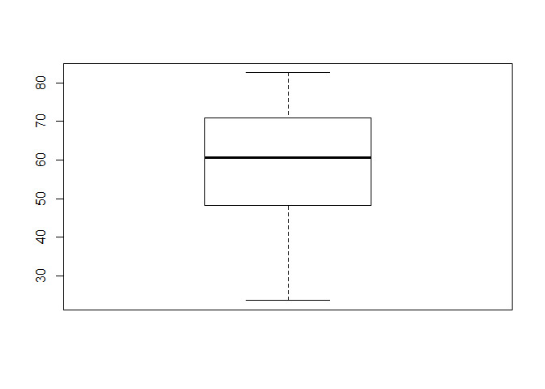
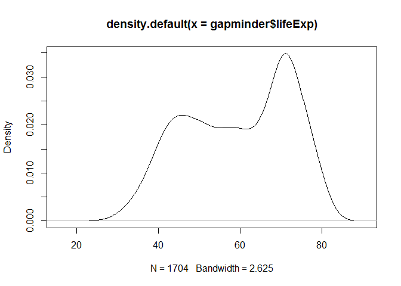
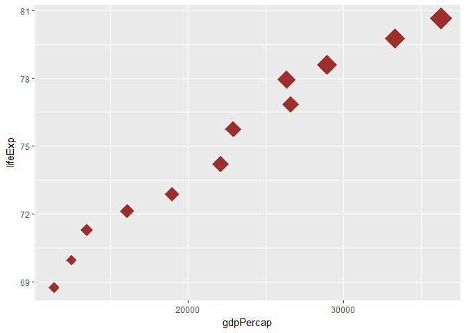
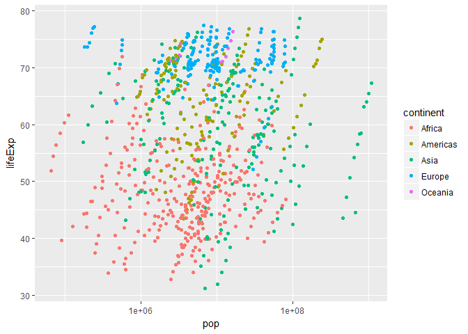
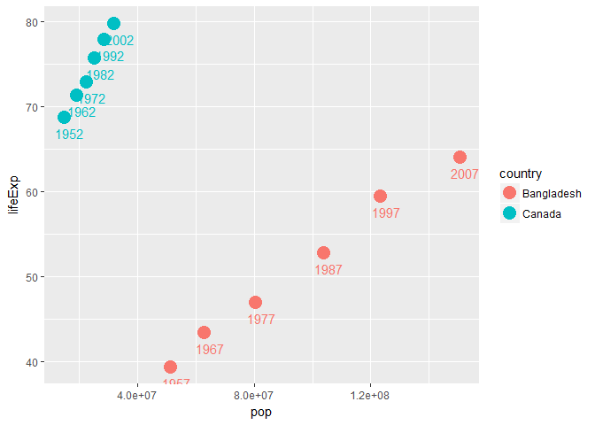
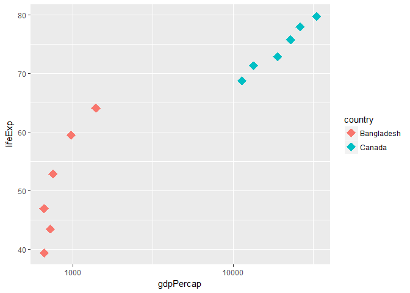

Homework 02: Explore Gapminder and use dplyr
================
RH
September 24, 2017

Exploring the gapminder object
------------------------------

For each section the code, plots, tables etc are after the questions. Some typed answers are given inline.

#### What type of data is it?

-   Is it a data.frame, a matrix, a vector, a list? **dataframe**
-   What’s its class? **‘tbl\_df’, ‘tbl’ and 'data.frame**
-   How many variables/columns? **6**
-   How many rows/observations? **1704**
-   Can you get these facts about “extent” or “size” in more than one way? Can you imagine different functions being useful in different contexts?
    -   yes, different functions can be useful in different situations as they can give us specific answers to our questions
    -   class(gapminder) will give the class of the data
    -   head(gapminder) to see the number of rows
    -   str(gapminder$pop) to get an idea of the number of rows
    -   typeof(gapminder$country) to get the type of each column
-   What data type is each variable?

``` r
data.frame(variable = names(gapminder), row.names = NULL, data.type = sapply(gapminder, typeof))%>%
  kable("markdown") %>%
  kable_styling(bootstrap_options = c("striped", "hover"))
```

| variable  | data.type |
|:----------|:----------|
| country   | integer   |
| continent | integer   |
| year      | integer   |
| lifeExp   | double    |
| pop       | integer   |
| gdpPercap | double    |

``` r
str(gapminder)
```

    ## Classes 'tbl_df', 'tbl' and 'data.frame':    1704 obs. of  6 variables:
    ##  $ country  : Factor w/ 142 levels "Afghanistan",..: 1 1 1 1 1 1 1 1 1 1 ...
    ##  $ continent: Factor w/ 5 levels "Africa","Americas",..: 3 3 3 3 3 3 3 3 3 3 ...
    ##  $ year     : int  1952 1957 1962 1967 1972 1977 1982 1987 1992 1997 ...
    ##  $ lifeExp  : num  28.8 30.3 32 34 36.1 ...
    ##  $ pop      : int  8425333 9240934 10267083 11537966 13079460 14880372 12881816 13867957 16317921 22227415 ...
    ##  $ gdpPercap: num  779 821 853 836 740 ...

``` r
ncol(gapminder)
```

    ## [1] 6

``` r
nrow(gapminder)
```

    ## [1] 1704

Exploring individual variables
------------------------------

-   categorical variable: **country**
-   quantitative variable: **lifeExp**

#### What are possible values (or range, whichever is appropriate) of each variable?

| variable name | type    | Values or Range     |
|---------------|---------|---------------------|
| continent     | factor  | 5 variables         |
| pop           | numeric | from 23.60 to 82.60 |

``` r
summary(gapminder$lifeExp) 
```

    ##    Min. 1st Qu.  Median    Mean 3rd Qu.    Max. 
    ##   23.60   48.20   60.71   59.47   70.85   82.60

``` r
str (gapminder$continent)
```

    ##  Factor w/ 5 levels "Africa","Americas",..: 3 3 3 3 3 3 3 3 3 3 ...

#### What values are typical? What’s the spread? What’s the distribution? Etc., tailored to the variable at hand.

Feel free to use summary stats, tables, figures. We’re NOT expecting high production value (yet).

For Life Expectancy: - The average value is 59.47 meaning people live about 60 years on average - The highest average age in any country is 82.60 - The standard deviation is 12.92

    ## [1] 12.91711



For Continent: - The most entries are for Africa and - the least entries are for Oceania

``` r
table(gapminder$continent)
```

    ## 
    ##   Africa Americas     Asia   Europe  Oceania 
    ##      624      300      396      360       24

Exploring plot types
--------------------

Density plot for Life Expectancy

``` r
plot(density(gapminder$lifeExp))
```



Canada's life expectancy and GDP both grow as population (indicated by the size of the points) increases

``` r
s <- round(filter(gapminder, country %in% c("Canada"))$pop/10^6.5)
p <- ggplot(filter(gapminder, country %in% c("Canada")),
            aes(x = gdpPercap, y = lifeExp))
p + geom_point(size = s, shape = 18, color = "dark red", alpha = .8)
```



Plotting life expectancy by population for each country shows that African countries have lower life Expectancy while European countries have higher life expectancy regardless of population size

``` r
q <- ggplot(filter(gapminder, year %in% 1962:1990),
       aes(y = lifeExp, x = pop, color = continent)) 
q <- q + scale_x_log10()
q + geom_point(shape = 19)
```



Use filter(), select() and %&gt;%
---------------------------------

I'm using these functions to compare Bangladesh (my home country) with Canada (my current country)

Comparing Bangladesh and Canada's life expectancy and population growth over the years

``` r
filter(gapminder, country == c("Canada", "Bangladesh"))%>%
  ggplot(aes(y = lifeExp, x = pop, col = country))  + geom_point(size = 5) + geom_text(aes(label = year), hjust = .3, vjust = 2)
```

 Comparing Bangladesh and Canada's life expectancy and GDP growth over the years shows how Bangladesh has managed to raise life expectancy without GDP increasing as much.

``` r
filter(gapminder, country == c("Canada", "Bangladesh"))%>%
  ggplot(aes(y = lifeExp, x = gdpPercap, col = country )) + geom_point(size = 5, shape = 18) + scale_x_log10()
```



The same thing in table form:

``` r
gapminder%>%
  filter(country == c("Canada", "Bangladesh"))%>%
  select(country, year, pop) %>%
  kable("html") %>%
  kable_styling()
```

<table class="table" style="margin-left: auto; margin-right: auto;">
<thead>
<tr>
<th style="text-align:left;">
country
</th>
<th style="text-align:right;">
year
</th>
<th style="text-align:right;">
pop
</th>
</tr>
</thead>
<tbody>
<tr>
<td style="text-align:left;">
Bangladesh
</td>
<td style="text-align:right;">
1957
</td>
<td style="text-align:right;">
51365468
</td>
</tr>
<tr>
<td style="text-align:left;">
Bangladesh
</td>
<td style="text-align:right;">
1967
</td>
<td style="text-align:right;">
62821884
</td>
</tr>
<tr>
<td style="text-align:left;">
Bangladesh
</td>
<td style="text-align:right;">
1977
</td>
<td style="text-align:right;">
80428306
</td>
</tr>
<tr>
<td style="text-align:left;">
Bangladesh
</td>
<td style="text-align:right;">
1987
</td>
<td style="text-align:right;">
103764241
</td>
</tr>
<tr>
<td style="text-align:left;">
Bangladesh
</td>
<td style="text-align:right;">
1997
</td>
<td style="text-align:right;">
123315288
</td>
</tr>
<tr>
<td style="text-align:left;">
Bangladesh
</td>
<td style="text-align:right;">
2007
</td>
<td style="text-align:right;">
150448339
</td>
</tr>
<tr>
<td style="text-align:left;">
Canada
</td>
<td style="text-align:right;">
1952
</td>
<td style="text-align:right;">
14785584
</td>
</tr>
<tr>
<td style="text-align:left;">
Canada
</td>
<td style="text-align:right;">
1962
</td>
<td style="text-align:right;">
18985849
</td>
</tr>
<tr>
<td style="text-align:left;">
Canada
</td>
<td style="text-align:right;">
1972
</td>
<td style="text-align:right;">
22284500
</td>
</tr>
<tr>
<td style="text-align:left;">
Canada
</td>
<td style="text-align:right;">
1982
</td>
<td style="text-align:right;">
25201900
</td>
</tr>
<tr>
<td style="text-align:left;">
Canada
</td>
<td style="text-align:right;">
1992
</td>
<td style="text-align:right;">
28523502
</td>
</tr>
<tr>
<td style="text-align:left;">
Canada
</td>
<td style="text-align:right;">
2002
</td>
<td style="text-align:right;">
31902268
</td>
</tr>
</tbody>
</table>
Creating gdpPerlifeyear which can be thought of as a crude measure of productivity to reflect the fact that different life expectancies should affect gdp

``` r
gap_copy <- gapminder
gap_copy%>%
  filter(year %in% c(2002,2007))%>%
  mutate(gdpPerlifeyear = gdpPercap/lifeExp) %>%
  arrange(desc(gdpPerlifeyear)) %>%
  head() %>%
  kable()
```

| country       | continent |  year|  lifeExp|        pop|  gdpPercap|  gdpPerlifeyear|
|:--------------|:----------|-----:|--------:|----------:|----------:|---------------:|
| Norway        | Europe    |  2007|   80.196|    4627926|   49357.19|        615.4570|
| Kuwait        | Asia      |  2007|   77.588|    2505559|   47306.99|        609.7204|
| Singapore     | Asia      |  2007|   79.972|    4553009|   47143.18|        589.4961|
| Norway        | Europe    |  2002|   79.050|    4535591|   44683.98|        565.2622|
| United States | Americas  |  2007|   78.242|  301139947|   42951.65|        548.9590|
| Ireland       | Europe    |  2007|   78.885|    4109086|   40676.00|        515.6366|

More
----

#### Evaluate this code and describe the result.

Presumably the analyst’s intent was to get the data for Rwanda and Afghanistan. Did they succeed? Why or why not? If not, what is the correct way to do this?

They seem to have succeeded in getting the data for Rwanda and Afghanistan. The result is a data frame with 12 observations for each of the variables which seems a little low as each country should have 12 observations.

A better way to do this might be using %in% instead of == as that would include all entries that include either Rwanda or Afghanistan and not just unique years.

``` r
filter(gapminder, country == c("Rwanda", "Afghanistan"))
```

    ## # A tibble: 12 x 6
    ##        country continent  year lifeExp      pop gdpPercap
    ##         <fctr>    <fctr> <int>   <dbl>    <int>     <dbl>
    ##  1 Afghanistan      Asia  1957  30.332  9240934  820.8530
    ##  2 Afghanistan      Asia  1967  34.020 11537966  836.1971
    ##  3 Afghanistan      Asia  1977  38.438 14880372  786.1134
    ##  4 Afghanistan      Asia  1987  40.822 13867957  852.3959
    ##  5 Afghanistan      Asia  1997  41.763 22227415  635.3414
    ##  6 Afghanistan      Asia  2007  43.828 31889923  974.5803
    ##  7      Rwanda    Africa  1952  40.000  2534927  493.3239
    ##  8      Rwanda    Africa  1962  43.000  3051242  597.4731
    ##  9      Rwanda    Africa  1972  44.600  3992121  590.5807
    ## 10      Rwanda    Africa  1982  46.218  5507565  881.5706
    ## 11      Rwanda    Africa  1992  23.599  7290203  737.0686
    ## 12      Rwanda    Africa  2002  43.413  7852401  785.6538

``` r
## a better way
filter(gapminder, country %in% c("Rwanda", "Afghanistan"))
```

    ## # A tibble: 24 x 6
    ##        country continent  year lifeExp      pop gdpPercap
    ##         <fctr>    <fctr> <int>   <dbl>    <int>     <dbl>
    ##  1 Afghanistan      Asia  1952  28.801  8425333  779.4453
    ##  2 Afghanistan      Asia  1957  30.332  9240934  820.8530
    ##  3 Afghanistan      Asia  1962  31.997 10267083  853.1007
    ##  4 Afghanistan      Asia  1967  34.020 11537966  836.1971
    ##  5 Afghanistan      Asia  1972  36.088 13079460  739.9811
    ##  6 Afghanistan      Asia  1977  38.438 14880372  786.1134
    ##  7 Afghanistan      Asia  1982  39.854 12881816  978.0114
    ##  8 Afghanistan      Asia  1987  40.822 13867957  852.3959
    ##  9 Afghanistan      Asia  1992  41.674 16317921  649.3414
    ## 10 Afghanistan      Asia  1997  41.763 22227415  635.3414
    ## # ... with 14 more rows
