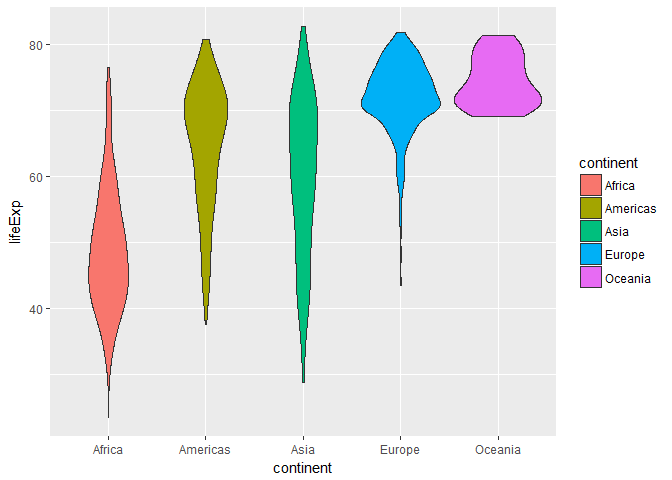
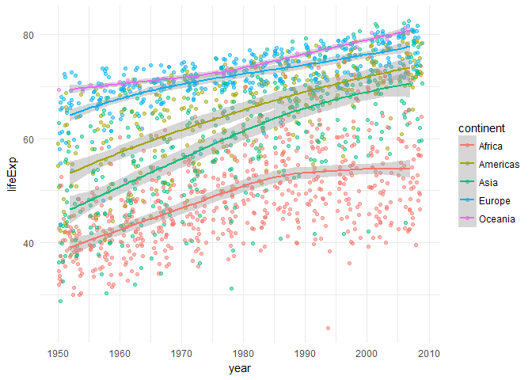

# Homework 03: Use dplyr to manipulate and explore data (also use ggplot2)
RH  
September 27, 2017  

This assignment looks at the gapminder data in more detail


#### Task 1

Get the maximum and minimum of GDP per capita for all continents.

First let's get this information in a table:

```r
q <- gapminder %>%
  group_by(continent) %>%
  summarize(minGDP = min(gdpPercap), maxGDP = max(gdpPercap), pop_cont = mean(pop))
q %>%
  kable("markdown")
```


|continent |     minGDP|    maxGDP| pop_cont|
|:---------|----------:|---------:|--------:|
|Africa    |   241.1659|  21951.21|  9916003|
|Americas  |  1201.6372|  42951.65| 24504795|
|Asia      |   331.0000| 113523.13| 77038722|
|Europe    |   973.5332|  49357.19| 17169765|
|Oceania   | 10039.5956|  34435.37|  8874672|

Plotting the data above helps illustrate that although the minimum GDP across continents is similar, the maximum GDP differs greatly; Asia has the widest gap between the richest and the poorest country.

```r
q %>%
  ggplot(aes(x = continent, colour = continent)) + 
  geom_point(aes(y = maxGDP),size = (q$pop_cont/5000000), shape = 19) + 
  geom_point(aes(y = minGDP),size = (q$pop_cont/5000000), shape = 19) +
  scale_y_continuous(breaks = c(20000, 40000, 60000, 80000, 100000), labels = c("20k", "40k", "60k", "80k", "100k")) 
```

<!-- -->


```r
gapminder %>%
  filter(continent=="Asia") %>%
  arrange(desc(gdpPercap))
```

```
## # A tibble: 396 x 6
##             country continent  year lifeExp     pop gdpPercap
##              <fctr>    <fctr> <int>   <dbl>   <int>     <dbl>
##  1           Kuwait      Asia  1957  58.033  212846 113523.13
##  2           Kuwait      Asia  1972  67.712  841934 109347.87
##  3           Kuwait      Asia  1952  55.565  160000 108382.35
##  4           Kuwait      Asia  1962  60.470  358266  95458.11
##  5           Kuwait      Asia  1967  64.624  575003  80894.88
##  6           Kuwait      Asia  1977  69.343 1140357  59265.48
##  7           Kuwait      Asia  2007  77.588 2505559  47306.99
##  8        Singapore      Asia  2007  79.972 4553009  47143.18
##  9           Kuwait      Asia  1997  76.156 1765345  40300.62
## 10 Hong Kong, China      Asia  2007  82.208 6980412  39724.98
## # ... with 386 more rows
```


#### Task 2


Look at the spread of GDP per capita within the continents. 
We see that:

* the GDP per Capita for every continent seems to be increasing over the years
* the increase is most consistent in Oceania and Europe
* Americas is also pretty consistent with some countries having faster growth than others
* Africa and Asia look interesting as there are a few countries which seem to have large falls in GDP


```r
gapminder %>%
  group_by(continent, year) %>%
  arrange(continent) %>%
  ggplot(aes(y=gdpPercap, x=year, colour = continent)) + 
  geom_jitter(alpha = .5) + 
  scale_x_continuous(breaks = c(1952, 1962, 1972, 1982, 1992, 2002),
                   labels = c("50", "60", "70", "80", "90", "00")) + 
  facet_wrap(~continent, scales = "free") +
  labs(title = "Spread of GDP",
       subtitle = "Looking at spread of GDP over continents")
```

<!-- -->

Let's look at Africa and Asia in more details.

First, Africa:

- Arranging by GDP per Capita shows that the highest per Capita GDP in Africa was in the 1960's, 70's and 80's
- These high GDP's come mainly from Libya and Gabon
- Both these countries GDPs seem to have fallen since then

```r
gapminder %>%
  group_by(continent) %>%
  arrange(desc(gdpPercap)) %>%
  filter(continent == "Africa") %>%
  head() %>%
  kable("markdown")
```


|country |continent | year| lifeExp|     pop| gdpPercap|
|:-------|:---------|----:|-------:|-------:|---------:|
|Libya   |Africa    | 1977|  57.442| 2721783|  21951.21|
|Gabon   |Africa    | 1977|  52.790|  706367|  21745.57|
|Libya   |Africa    | 1972|  52.773| 2183877|  21011.50|
|Libya   |Africa    | 1967|  50.227| 1759224|  18772.75|
|Libya   |Africa    | 1982|  62.155| 3344074|  17364.28|
|Gabon   |Africa    | 1982|  56.564|  753874|  15113.36|
<a id="libgab"></a> Let's plot Libya and Gabon's GDP per Capita over the years:

- It seems both countries experienced a GDP boom in the 1960's
- Both countries GDP again dropped in late 1970's
- I was curious why such a change might happen so plotted the population for these years. It seems that the population for both countries increased at a steady rate over the years.

```r
gapminder %>%
  filter(country %in% c("Libya", "Gabon")) %>%
  group_by(country) %>%
  ggplot(aes(y = gdpPercap, x= year, colour = country)) + 
  geom_line(size = 1) + 
  geom_point(aes(size = pop)) + 
  theme_minimal()
```

<!-- -->

I was curious about this so looked at a little history:

* 1951: Libya declared its independence as the United Kingdom of Libya
* 1959: discovery of significant oil reserves **of course - oil**
* 1969: a group of rebel military officers led by Muammar Gaddafi launched a coup d'état against King Idris, which became known as the Al Fateh Revolution
* 1977: The [Chadian–Libyan conflict](https://en.wikipedia.org/wiki/Chadian%E2%80%93Libyan_conflict) & the [Libyan-Egyptian War](https://en.wikipedia.org/wiki/Libyan%E2%80%93Egyptian_War) **of course - war**

For Gabon: 

- 1960: The territories of French Equatorial Africa became independent **freedom from France**
- 1970's: Economic problems

Is it a similar story for Asia?
Looks like it might be Kuwait in this case which seems to have a similar pattern of high GDP per capita in the 60's and 70's, likely driven by oil sales.


```r
gapminder %>%
  group_by(continent) %>%
  arrange(desc(gdpPercap)) %>%
  filter(continent == "Asia") %>%
  head() %>%
  kable("markdown")
```


|country |continent | year| lifeExp|     pop| gdpPercap|
|:-------|:---------|----:|-------:|-------:|---------:|
|Kuwait  |Asia      | 1957|  58.033|  212846| 113523.13|
|Kuwait  |Asia      | 1972|  67.712|  841934| 109347.87|
|Kuwait  |Asia      | 1952|  55.565|  160000| 108382.35|
|Kuwait  |Asia      | 1962|  60.470|  358266|  95458.11|
|Kuwait  |Asia      | 1967|  64.624|  575003|  80894.88|
|Kuwait  |Asia      | 1977|  69.343| 1140357|  59265.48|


#### Task 3

How is life expectancy changing over time on different continents?

Life Expectancy seems to be increasing over the years in every continent. In order to look at this I computed increase in life expectancy every year measured to see if there is anything interesting here.

- In 1957 the increase in life expectancy since the previous measure was the highest in Asia
- Except for a few years in Africa (1997 & 2002) life expectancy has increased every year and in every continent


```r
data2 <- gapminder %>%
  group_by(country) %>%
  mutate(lifeExpincrease = lifeExp - lag(lifeExp)) %>%
  filter (!is.na(lifeExpincrease)) %>%
  group_by(continent,year) %>%
  summarize(lifeExpincrease = mean(lifeExpincrease)) %>%
  arrange(year)
data2
```

```
## # A tibble: 55 x 3
## # Groups:   continent [5]
##    continent  year lifeExpincrease
##       <fctr> <int>           <dbl>
##  1    Africa  1957        2.130846
##  2  Americas  1957        2.680440
##  3      Asia  1957        3.004150
##  4    Europe  1957        2.294567
##  5   Oceania  1957        1.040000
##  6    Africa  1962        2.053096
##  7  Americas  1962        2.438480
##  8      Asia  1962        2.244679
##  9    Europe  1962        1.836167
## 10   Oceania  1962        0.790000
## # ... with 45 more rows
```
I saw this interesting violin plot option and thought I would try it on life expectancy as it reminded me of the demography plots we would see in geography.

It shows that life expectancy has much wider ranges in Africa and Asia than in most continents and that the fattest portion (the mode) is lowest in Africa. In fact in Africa life expectancy seems to go down to the 20's. I think this is a nice way of representing the life expectancy data 

```r
gapminder %>%
  group_by(continent) %>%
  ggplot(aes(y = lifeExp, x = continent)) + 
  geom_violin(scale = "area", aes(fill = continent))
```

<!-- -->
The following figure shows how life expectancy has increased across the years. It also illustrates how it has flattened out in the 1990's in Africa


```r
gapminder %>%
  group_by(continent, year) %>%
  ggplot(aes(y = lifeExp, x = year, colour = continent)) + 
  geom_jitter(alpha = .5) +
  geom_smooth(method = "loess", size = 1) + 
  theme_minimal()
```

<!-- -->


```r
ggplot(data2, aes(x= year, y = lifeExpincrease, colour = continent)) + 
  geom_point() + 
  geom_line() + 
  theme_minimal() + 
  labs(y = "Increase in life expectancy in years", 
       title = "Change in Life Expectancy over the Years",
       subtitle = "Has life expectancy always gone up?")
```

<!-- -->

Q: What happened in the late 90's and early 2000's in Africa to cause a fall in life expectancy?
Ans: a lot of war and genocide

```r
gapminder %>%
  filter(continent == "Africa", year %in% c("1992", "1997", "2002")) %>%
  mutate(lifeExpincrease = lifeExp - lag(lifeExp)) %>%
  arrange (lifeExpincrease) %>%
  head() %>%
  kable()
```


country             continent    year   lifeExp        pop   gdpPercap   lifeExpincrease
------------------  ----------  -----  --------  ---------  ----------  ----------------
Rwanda              Africa       1992    23.599    7290203    737.0686           -52.145
Angola              Africa       1992    40.647    8735988   2627.8457           -30.347
Mozambique          Africa       1992    44.284   13160731    410.8968           -25.331
Uganda              Africa       1992    48.825   18252190    644.1708           -24.217
Sierra Leone        Africa       1992    38.333    4260884   1068.6963           -23.267
Equatorial Guinea   Africa       1992    47.545     387838   1132.0550           -22.261
In 1992, the average life expectancy fell by 52 years in Rwanda. This is likely the result of the [genocide in Rwanda](https://en.wikipedia.org/wiki/Rwandan_genocide) which started in 1990 and is estimated to have killed about 1 million people

Similarly in 1992 the average life expectancy fell by 

- 30 years in Angola - [civil war](https://en.wikipedia.org/wiki/Angolan_Civil_War)
- 25 years in Mozambique - [civil war](https://en.wikipedia.org/wiki/Mozambican_Civil_War)
- 24 years in Uganda - part of [Rwandan genocide](https://en.wikipedia.org/wiki/Rwandan_genocide)
- 23 years in Sierra Leone - [civil war](https://en.wikipedia.org/wiki/Sierra_Leone_Civil_War)


#### Task 4

Find countries with interesting stories. Open-ended and, therefore, hard. Promising but unsuccessful attempts are encouraged. This will generate interesting questions to follow up on in class.

I think I partially did this with [Libya and Gabon](#libgab) but I also wanted to take a closer look at my country Bangladesh and see if there was an interesting story I could find.

First let's create a data frame with only bangladesh in it

```r
bd <- gapminder %>%
  filter(country == "Bangladesh") %>%
  mutate(popmil = pop/10^6, gdpcap = gdpPercap/10)
bd %>% 
  kable("markdown")
```


|country    |continent | year| lifeExp|       pop| gdpPercap|    popmil|    gdpcap|
|:----------|:---------|----:|-------:|---------:|---------:|---------:|---------:|
|Bangladesh |Asia      | 1952|  37.484|  46886859|  684.2442|  46.88686|  68.42442|
|Bangladesh |Asia      | 1957|  39.348|  51365468|  661.6375|  51.36547|  66.16375|
|Bangladesh |Asia      | 1962|  41.216|  56839289|  686.3416|  56.83929|  68.63416|
|Bangladesh |Asia      | 1967|  43.453|  62821884|  721.1861|  62.82188|  72.11861|
|Bangladesh |Asia      | 1972|  45.252|  70759295|  630.2336|  70.75929|  63.02336|
|Bangladesh |Asia      | 1977|  46.923|  80428306|  659.8772|  80.42831|  65.98772|
|Bangladesh |Asia      | 1982|  50.009|  93074406|  676.9819|  93.07441|  67.69819|
|Bangladesh |Asia      | 1987|  52.819| 103764241|  751.9794| 103.76424|  75.19794|
|Bangladesh |Asia      | 1992|  56.018| 113704579|  837.8102| 113.70458|  83.78102|
|Bangladesh |Asia      | 1997|  59.412| 123315288|  972.7700| 123.31529|  97.27700|
|Bangladesh |Asia      | 2002|  62.013| 135656790| 1136.3904| 135.65679| 113.63904|
|Bangladesh |Asia      | 2007|  64.062| 150448339| 1391.2538| 150.44834| 139.12538|

We can then plot a graph showing the information above:
The line at 1971 is for when Bangladesh gained its independence - there is a fall in GDP per capita at that time.Interestingly there seems to be no effect on population although hundreds of thousands of people were reported dying.


```r
ggplot(bd) + 
  geom_line(aes(x = year, y = popmil), 
            size = 1, 
            colour = "dark green") +
  geom_text(data = filter(bd, year == 2007), 
        aes(x= year, y= popmil, label = "Population"), 
        colour = "dark green") +
  geom_line(aes(x= year, y= gdpcap), 
            size = 1, 
            colour = "dark red") + 
  geom_text(data = filter(bd, year == 2007), 
        aes(x= year, y= gdpcap, label = "GDP \nPer Capita"), 
        colour = "dark red", 
        nudge_x = -1) + 
  geom_line(aes(x= year, y= lifeExp), 
            size = 1, 
            colour = "dark blue") + 
  geom_text(data = filter(bd, year == 2007), 
        aes(x= year, y= lifeExp, label = "Life \nExpectancy"), 
        colour = "dark blue",
        nudge_x = -3, nudge_y = 2) + 
  geom_vline(xintercept = 1971) + 
  theme_minimal()
```

<!-- -->

How did we do in comparison with the rest of Asia?

Well, for one thing life expectancy has been increasing at a fast rate, partially in line with the rest of asia. Although life expectancy is still not that high it is better than many other countries.


```r
gapminder %>%
  filter (continent == "Asia") %>%
  ggplot (aes(y=lifeExp, x = year)) + 
  scale_y_log10() +
  geom_jitter(colour = "blue") + 
  geom_point(data = bd, aes(y = lifeExp, x = year),
             colour = "red") + 
  geom_line(data = bd, aes(y = lifeExp, x = year),
             colour = "red") + 
  theme_minimal()
```

<!-- -->


