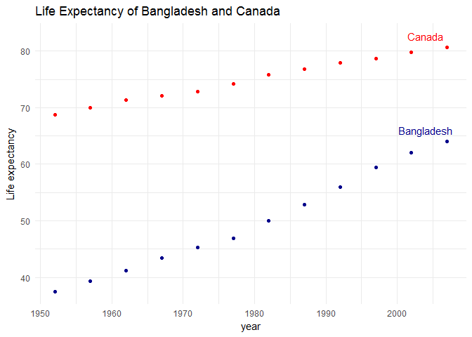
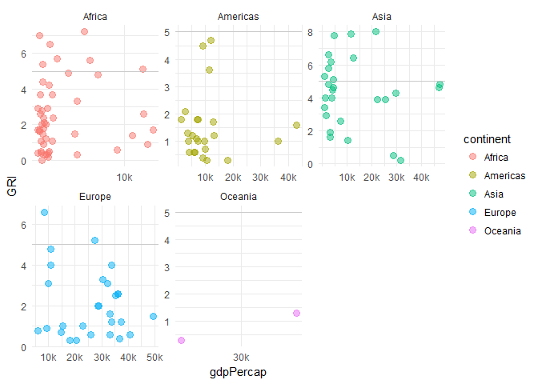

Homework 04: Tidy data and joins
================
RH
October 8, 2017

-   [Choose your own adventure:](#choose-your-own-adventure)
    -   [Data reshaping](#data-reshaping)
    -   [Data Joining](#data-joining)

The goal of this homework is to solidify your data wrangling skills by working some realistic problems in the grey area between data aggregation and data reshaping. You can find the instructions for this assignment [here](http://stat545.com/hw04_tidy-data-joins.html)

Choose your own adventure:
==========================

Data reshaping
--------------

Activity \#2

Make a tibble with one row per year and columns for life expectancy for two or more countries. Use knitr::kable() to make this table look pretty in your rendered homework. Take advantage of this new data shape to scatterplot life expectancy for one country against that of another.

``` r
#first let's create a new dataset with our 2 countries, Bangladesh and Canada
bdcan <- gapminder %>%
      filter(country %in% c("Bangladesh", "Canada")) %>%
      select(year, country, lifeExp) %>%             # selecting only interested values
      spread(key = "country", value = "lifeExp") 
      
#let's have a look at this data, we should have 24 observations
knitr::kable(bdcan, format = "markdown", digits = 2)
```

|  year|  Bangladesh|  Canada|
|-----:|-----------:|-------:|
|  1952|       37.48|   68.75|
|  1957|       39.35|   69.96|
|  1962|       41.22|   71.30|
|  1967|       43.45|   72.13|
|  1972|       45.25|   72.88|
|  1977|       46.92|   74.21|
|  1982|       50.01|   75.76|
|  1987|       52.82|   76.86|
|  1992|       56.02|   77.95|
|  1997|       59.41|   78.61|
|  2002|       62.01|   79.77|
|  2007|       64.06|   80.65|

``` r
# and now let's plot the data 
 ggplot(bdcan, aes(x = year, legend = Bangladesh)) + 
  geom_point(aes(y = Bangladesh), colour = "dark blue") + 
    geom_text(data = filter(bdcan, year == 2007), 
        aes(x= year, y= Bangladesh, label = "Bangladesh"), 
        colour = "dark blue",
        nudge_x = -3, nudge_y = 2) + 
  geom_point(aes (y = Canada), colour = "red") + 
    geom_text(data = filter(bdcan, year == 2007), 
        aes(x= year, y= Canada, label = "Canada"), 
        colour = "red",
        nudge_x = -3, nudge_y = 2) + 

  
  labs(title = "Life Expectancy of Bangladesh and Canada",
       x = "year", 
       y = "Life expectancy") + 
  theme_minimal()
```



Data Joining
------------

Activity \#1

Create a second data frame, complementary to Gapminder. Join this with (part of) Gapminder using a dplyr join function and make some observations about the process and result. Explore the different types of joins. Examples of a second data frame you could build: One row per country, a country variable and one or more variables with extra info, such as language spoken, NATO membership, national animal, or capitol city. If you really want to be helpful, you could attempt to make a pull request to resolve this issue, where I would like to bring ISO country codes into the gapminder package. One row per continent, a continent variable and one or more variables with extra info, such as northern versus southern hemisphere.

I selected the first 10 questions in the pew research survey on global religious restrictions rather than creating my own dataset. We'll focus on the following 2 index variables:

-   GRI: Government Restrictions Index based on 20 indicators of ways that national and local governments restrict religion, including through coercion and force.
-   SHI: Social Hostilities Index based on 13 indicators of ways in which private individuals and social groups infringe upon religious beliefs and practices, including religiously biased crimes, mob violence and efforts to stop particular religious groups from growing or operating.

``` r
setwd("F:/Documents/UBC/R & other codes/stat545/STAT545-hw-habib-rishad/hw04/data/")
pewdata <- read.csv("global religious restrictions.csv")

# let's change the country and year column names
pewdata <- rename(pewdata, country = Ctry_EditorialName)
pewdata <- rename(pewdata, year = Question_Year)
head(pewdata)
```

    ##   Nation_fk      Region5      Region6     country year GRI SHI GRI_Q_10
    ## 1         1 Asia-Pacific Asia-Pacific Afghanistan 2007 5.3 8.5        0
    ## 2         1 Asia-Pacific Asia-Pacific Afghanistan 2008 5.3 7.8        0
    ## 3         1 Asia-Pacific Asia-Pacific Afghanistan 2009 6.5 8.6        1
    ## 4         1 Asia-Pacific Asia-Pacific Afghanistan 2010 8.0 7.7        1
    ## 5         1 Asia-Pacific Asia-Pacific Afghanistan 2011 8.0 7.4        1
    ## 6         1 Asia-Pacific Asia-Pacific Afghanistan 2012 8.1 9.6        1
    ##   GRI_Q_9 GRI_Q_8 GRI_Q_7 GRI_Q_6 GRI_Q_5 GRI_Q_4 GRI_Q_3 GRI_Q_2 GRI_Q_1
    ## 1     0.5       1       1     0.5     0.0    0.67    0.67    0.67     0.5
    ## 2     0.5       1       1     0.5     0.5    0.67    0.67    0.67     0.5
    ## 3     0.5       1       1     0.5     0.0    1.00    1.00    0.67     0.5
    ## 4     0.5       1       1     0.5     0.0    1.00    0.67    0.67     0.5
    ## 5     0.5       1       1     0.5     0.0    1.00    1.00    0.67     0.5
    ## 6     0.5       1       1     0.5     0.0    1.00    1.00    0.67     0.5

The pewdata contains country and year names like the gapminder data. However they only have data from 2007 while gapminder only has data from 2007. So, inner\_join will be used to join the data together as it returns all rows from x where there are matching values in y, and all columns from x and y.

``` r
pewgap <- inner_join(gapminder, pewdata)
```

    ## Joining, by = c("country", "year")

    ## Warning: Column `country` joining factors with different levels, coercing
    ## to character vector

``` r
head(pewgap) %>%
  kable(digits = 2)
```

| country     | continent |  year|  lifeExp|       pop|  gdpPercap|  Nation\_fk| Region5                  | Region6                  |  GRI|  SHI|  GRI\_Q\_10|  GRI\_Q\_9|  GRI\_Q\_8|  GRI\_Q\_7|  GRI\_Q\_6|  GRI\_Q\_5|  GRI\_Q\_4|  GRI\_Q\_3|  GRI\_Q\_2|  GRI\_Q\_1|
|:------------|:----------|-----:|--------:|---------:|----------:|-----------:|:-------------------------|:-------------------------|----:|----:|-----------:|----------:|----------:|----------:|----------:|----------:|----------:|----------:|----------:|----------:|
| Afghanistan | Asia      |  2007|    43.83|  31889923|     974.58|           1| Asia-Pacific             | Asia-Pacific             |  5.3|  8.5|           0|        0.5|          1|          1|        0.5|        0.0|       0.67|       0.67|       0.67|        0.5|
| Albania     | Europe    |  2007|    76.42|   3600523|    5937.03|           2| Europe                   | Europe                   |  0.8|  0.2|           0|        0.5|          0|          0|        0.0|        0.0|       0.00|       0.00|       0.00|        0.0|
| Algeria     | Africa    |  2007|    72.30|  33333216|    6223.37|           3| Middle East-North Africa | Middle East-North Africa |  5.6|  3.6|           0|        0.5|          1|          1|        0.5|        0.5|       1.00|       0.67|       1.00|        1.0|
| Angola      | Africa    |  2007|    42.73|  12420476|    4797.23|           6| Sub-Saharan Africa       | Sub-Saharan Africa       |  3.3|  3.7|           0|        0.0|          0|          0|        0.0|        0.0|       1.00|       0.33|       0.67|        0.5|
| Argentina   | Americas  |  2007|    75.32|  40301927|   12779.38|           9| Americas                 | Latin America-Caribbean  |  1.7|  0.6|           0|        0.0|          0|          0|        0.0|        0.0|       0.00|       0.00|       0.67|        0.5|
| Australia   | Oceania   |  2007|    81.23|  20434176|   34435.37|          12| Asia-Pacific             | Asia-Pacific             |  1.3|  1.8|           0|        0.0|          0|          0|        0.0|        1.0|       0.33|       0.00|       0.00|        0.0|

We can plot our new data and show the government restriction index on the y axis and gdp per capita on the x axis.

This shows that most continents have a wide range of government restrictions. Although some continents seem to have higher GDP per capita than others, they still have countries with restrictive governments. I plotted a horizontal line at the scale midpoint for GRI which shows that surprisingly all countries in the Americas have low restrictive governments. Asia and Africa on the other hand have about 50:50 countries below and above the midpoint.

``` r
pewgap %>%
  select (country, continent, gdpPercap, pop, GRI, SHI) %>%
  ggplot(aes(x = gdpPercap, y = GRI, colour = continent)) + 
  geom_point(size = 3, alpha = .5) + 
  facet_wrap(~continent, scales = "free") + 
  scale_x_continuous(breaks = c(10000, 20000, 30000, 40000, 50000), labels = c("10k", "20k", "30k", "40k", "50k")) + 
  geom_hline(yintercept = 5, colour = "grey", alpha = .7)+
  theme_minimal()
```



We could also try a different join function such as left\_join

``` r
head(left_join(pewdata, gapminder)) %>%
  kable(digits = 2)
```

    ## Joining, by = c("country", "year")

    ## Warning: Column `country` joining factors with different levels, coercing
    ## to character vector

|  Nation\_fk| Region5      | Region6      | country     |  year|  GRI|  SHI|  GRI\_Q\_10|  GRI\_Q\_9|  GRI\_Q\_8|  GRI\_Q\_7|  GRI\_Q\_6|  GRI\_Q\_5|  GRI\_Q\_4|  GRI\_Q\_3|  GRI\_Q\_2|  GRI\_Q\_1| continent |  lifeExp|       pop|  gdpPercap|
|-----------:|:-------------|:-------------|:------------|-----:|----:|----:|-----------:|----------:|----------:|----------:|----------:|----------:|----------:|----------:|----------:|----------:|:----------|--------:|---------:|----------:|
|           1| Asia-Pacific | Asia-Pacific | Afghanistan |  2007|  5.3|  8.5|           0|        0.5|          1|          1|        0.5|        0.0|       0.67|       0.67|       0.67|        0.5| Asia      |    43.83|  31889923|     974.58|
|           1| Asia-Pacific | Asia-Pacific | Afghanistan |  2008|  5.3|  7.8|           0|        0.5|          1|          1|        0.5|        0.5|       0.67|       0.67|       0.67|        0.5| NA        |       NA|        NA|         NA|
|           1| Asia-Pacific | Asia-Pacific | Afghanistan |  2009|  6.5|  8.6|           1|        0.5|          1|          1|        0.5|        0.0|       1.00|       1.00|       0.67|        0.5| NA        |       NA|        NA|         NA|
|           1| Asia-Pacific | Asia-Pacific | Afghanistan |  2010|  8.0|  7.7|           1|        0.5|          1|          1|        0.5|        0.0|       1.00|       0.67|       0.67|        0.5| NA        |       NA|        NA|         NA|
|           1| Asia-Pacific | Asia-Pacific | Afghanistan |  2011|  8.0|  7.4|           1|        0.5|          1|          1|        0.5|        0.0|       1.00|       1.00|       0.67|        0.5| NA        |       NA|        NA|         NA|
|           1| Asia-Pacific | Asia-Pacific | Afghanistan |  2012|  8.1|  9.6|           1|        0.5|          1|          1|        0.5|        0.0|       1.00|       1.00|       0.67|        0.5| NA        |       NA|        NA|         NA|

This leaves us with a lot of NA values as only 2007 is a common year. Inner join is a more appropriate option.
