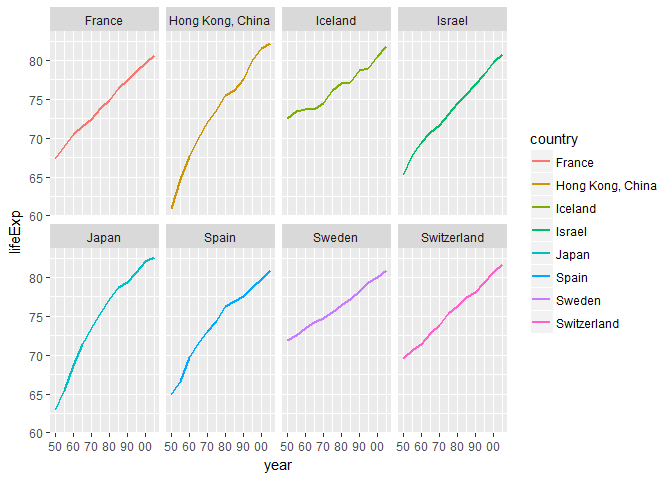
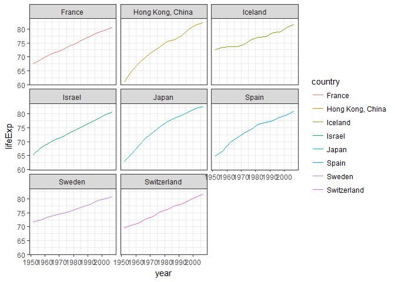
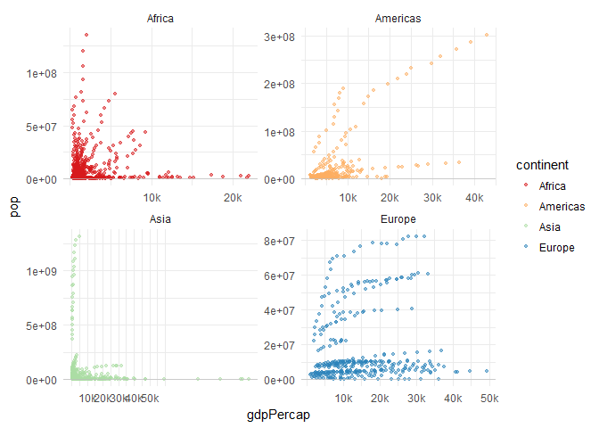

Homework 05: Factor and figure management; Repo hygiene
================
RH
October 20, 2017

-   [Factor management](#factor-management)
    -   [Drop Oceania](#drop-oceania)
    -   [Reorder the levels of country](#reorder-the-levels-of-country)
-   [File I/O](#file-io)
-   [Visualization design](#visualization-design)
-   [Writing figures to file](#writing-figures-to-file)

### Factor management

##### Drop Oceania

``` r
gapminder %>%
  filter(continent == "Oceania")        # we have 24 observations in Oceania for 2 countries
```

    ## # A tibble: 24 x 6
    ##      country continent  year lifeExp      pop gdpPercap
    ##       <fctr>    <fctr> <int>   <dbl>    <int>     <dbl>
    ##  1 Australia   Oceania  1952   69.12  8691212  10039.60
    ##  2 Australia   Oceania  1957   70.33  9712569  10949.65
    ##  3 Australia   Oceania  1962   70.93 10794968  12217.23
    ##  4 Australia   Oceania  1967   71.10 11872264  14526.12
    ##  5 Australia   Oceania  1972   71.93 13177000  16788.63
    ##  6 Australia   Oceania  1977   73.49 14074100  18334.20
    ##  7 Australia   Oceania  1982   74.74 15184200  19477.01
    ##  8 Australia   Oceania  1987   76.32 16257249  21888.89
    ##  9 Australia   Oceania  1992   77.56 17481977  23424.77
    ## 10 Australia   Oceania  1997   78.83 18565243  26997.94
    ## # ... with 14 more rows

``` r
dropOceania <- gapminder %>% 
  filter(continent != "Oceania") %>%    # create a new variable dropOceania which filters out Oceania
  droplevels()

dropOceania %>%
  group_by(continent) %>%
  summarize(mean_pop = mean(pop))       # we see here that oceania is no longer listed
```

    ## # A tibble: 4 x 2
    ##   continent mean_pop
    ##      <fctr>    <dbl>
    ## 1    Africa  9916003
    ## 2  Americas 24504795
    ## 3      Asia 77038722
    ## 4    Europe 17169765

##### Reorder the levels of country

``` r
gapReorder <- fct_reorder(dropOceania$country, 
                          dropOceania$lifeExp, 
                          fun = max, 
                          .desc= TRUE) %>%      # we are reordering country based on lifeExp 
              levels() %>%
              head(8)                         

# Let's look at this new reordered data
gapReorder
```

    ## [1] "Japan"            "Hong Kong, China" "Iceland"         
    ## [4] "Switzerland"      "Spain"            "Sweden"          
    ## [7] "Israel"           "France"

``` r
maxlife <- dropOceania %>% 
  filter(country %in% gapReorder)

  # now we can plot this new data
  ggplot(maxlife, aes(x=year, y=lifeExp, colour = country)) +
  geom_line(size = 1) + 
  facet_wrap(~country, nrow = 2) +
  scale_x_continuous(breaks = c(1952, 1962, 1972, 1982, 1992, 2002),
                   labels = c("50", "60", "70", "80", "90", "00"))
```



Using arrange to draw a figure gives the following:

``` r
arrange(maxlife, lifeExp) %>% 
  ggplot(aes(x=year, y=lifeExp, colour = country)) +
  geom_line() +
  facet_wrap(~country) + 
  theme_bw()
```



The look of this graph is quite similar to the previous one.

### File I/O

Let's use write\_csv and read\_csv to get this subset of data in and out of r

``` r
write_csv(maxlife, "~/maxlife.csv")         # writes the file
MaxGDP_Read <- read_csv("~/maxlife.csv")    # reads back the file
```

    ## Parsed with column specification:
    ## cols(
    ##   country = col_character(),
    ##   continent = col_character(),
    ##   year = col_integer(),
    ##   lifeExp = col_double(),
    ##   pop = col_integer(),
    ##   gdpPercap = col_double()
    ## )

### Visualization design

Objective: Remake at least one figure

Let's try and make a plot I made in hw04 look better

``` r
plot1 <- dropOceania %>%
  select (country, continent, gdpPercap, pop, year) %>%
  ggplot(aes(x = gdpPercap, y = pop, colour = continent)) + 
  geom_point(size = 1, alpha = .5) +
  facet_wrap(~continent, scales = "free") +
  scale_x_continuous(breaks = c(10000, 20000, 30000, 40000, 50000), labels = c("10k", "20k", "30k", "40k", "50k")) + 
  geom_hline(yintercept = 5, colour = "grey", alpha = .7)+
  theme_minimal() +
  scale_colour_brewer(palette="Spectral")
plot1
```



### Writing figures to file

``` r
ggsave("dropOceania.pdf", plot1, width=6, height=4, units="in")
ggsave("../hw05/hw05_files/dropOceania.pdf", 
       device = "pdf", 
       width = 10,
       height = 10)
```
